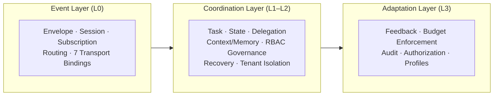
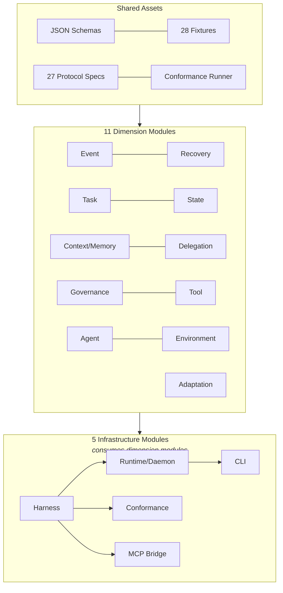

# Harmovela Protocol

> [中文文档 (Chinese)](README_zh.md) | [Spec Site](https://axisrobo.github.io/harmovela/)

**Harmovela Protocol** is an open coordination protocol for autonomous systems. It defines how agents, tools, memory systems, context providers, environment observers, and multi-agent runtimes coordinate across seven interdependent dimensions:

| Dimension | What Harmovela defines |
|---|---|
| Event | What happened — publish, subscribe, correlate, replay, acknowledge. |
| Task | What is executing — lifecycle from submitted through completed, failed, or cancelled. |
| State | What is true now — versioned state, freshness windows, invalidation, change propagation. |
| Context / Memory | What informs decisions — updates, invalidation, provenance, retrieval readiness. |
| Delegation | Who does what — assignment, acceptance, handoff, escalation, cancellation propagation. |
| Recovery | What to do when things break — idempotency, replay, checkpoints, interruption, compensation. |
| Governance | Who can do what — identity, authorization, audit, tenant isolation, policy integration. |

Harmovela complements MCP. MCP remains the synchronous capability invocation layer; Harmovela provides the asynchronous coordination layer — event streams, task lifecycle, state management, context awareness, delegation, recovery, and governance.

## About

The current 0.5 Adaptation Preview is a multi-language protocol repository with:

- **13 dimension modules** (Event, Task, State, Context/Memory, Delegation, Recovery, Governance, Tool, Agent, Environment, Adaptation, Command, Query)
- **5 infrastructure modules** (Harness, Runtime, CLI, Conformance, MCP Bridge)
- **17 protocol specifications** covering session, subscription, task, error, versioning, delivery, reliability, security, conformance, and transport layers
- **4 productized implementations** (TypeScript, Python, Go, Java) — each with runtime daemon, CLI, HTTP API, subscriptions, MCP bridge, and delivery stores
- **34 conformance fixtures** with cross-language validation
- **~700 tests** across four languages, all passing
- **7 transport bindings** (stdio, WebSocket, SSE, gRPC, NATS, Kafka, Redis Streams) implemented across all languages
- **SQLite and PostgreSQL delivery stores** with retry, dead-letter, replay, and cross-language conformance
- **Spec site** at [axisrobo.github.io/harmovela](https://axisrobo.github.io/harmovela/)



## Vision

Autonomous systems need more than synchronous tool calls. They need to sense, decide, act, recover, and coordinate continuously. Harmovela Protocol provides the open coordination layer for that continuous cycle.

Harmovela integrates three interwoven qualities:

- **Connection & Collaboration**: network effects across autonomous entities, collective intelligence that grows with participants, alignment across agents, tools, and runtimes.
- **Dynamic & Evolution**: continuous adaptation to changing environments, emergence of coordinated behavior, flow of context and state over time.
- **Order & Governance**: trust through verifiable boundaries, balance between autonomy and constraint, resilient coordination under uncertainty.

## Scope

Harmovela covers:

- **Event**: publish, subscribe, correlate, replay, acknowledge — the complete event lifecycle.
- **Task**: lifecycle from submitted through accepted, executing, progressing, completed, failed, or cancelled — with timeout, blockage, and output streaming.
- **State**: versioned state, freshness windows, invalidation, change propagation — what is true now.
- **Context / Memory**: updates, invalidation, provenance, retrieval readiness — what informs decisions.
- **Delegation**: assignment, acceptance, handoff, escalation, cancellation propagation — who does what.
- **Recovery**: idempotency, replay, checkpoints, interruption, compensation — what to do when things break.
- **Governance**: identity, authorization, audit, tenant isolation, policy integration — who can do what.

Harmovela does not replace:

- MCP synchronous tool invocation
- LLM completion APIs
- Vector database APIs
- Business-specific memory schemas
- General-purpose message brokers

## Relationship To MCP

| MCP | Harmovela |
| --- | --- |
| Synchronous request / response | Asynchronous coordination streams |
| Tool invocation | Task lifecycle and tool feedback |
| Resource reading | Context updates, state changes, invalidation |
| Client-driven calls | Producer-driven events |
| Immediate result | Deferred, incremental, replayable results |

Harmovela should interoperate with MCP rather than fork it. Harmovela can carry events about MCP tool calls, but it should remain protocol-independent enough to support non-MCP agents, tools, memory systems, robotics systems, browsers, IDEs, and cloud runtimes.


## Documents

### Core (English)

- `docs/vision.md` -- project vision, goals, non-goals, and principles ([中文](docs/zh/vision.md))
- `docs/architecture.md` -- system architecture and major protocol layers ([中文](docs/zh/architecture.md))
- `docs/differentiation.md` -- non-normative positioning and comparison material
- `docs/protocol-design.md` -- initial protocol model, envelope, events, and lifecycle ([中文](docs/zh/protocol-design.md))
- `docs/mcp-relationship.md` -- detailed comparison and interop model with MCP
- `docs/roadmap.md` -- proposed phases toward a usable open protocol

### Protocol Specs (`docs/protocol/`)

- `docs/protocol/session.md` -- session lifecycle specification
- `docs/protocol/subscription.md` -- subscription model specification
- `docs/protocol/task-lifecycle.md` -- task lifecycle specification
- `docs/protocol/error-model.md` -- error model specification
- `docs/protocol/versioning.md` -- versioning rules specification
- `docs/protocol/transport-stdio.md` -- stdio transport specification
- `docs/protocol/transport-websocket.md` -- WebSocket transport specification
- `docs/protocol/transport-sse.md` -- HTTP SSE transport specification
- `docs/protocol/transport-grpc.md` -- gRPC streaming transport specification
- `docs/protocol/transport-kafka.md` -- Kafka transport specification
- `docs/protocol/transport-nats.md` -- NATS transport specification
- `docs/protocol/transport-redis-streams.md` -- Redis Streams transport specification
- `docs/protocol/delivery.md` -- delivery semantics, acknowledgement, and replay specification
- `docs/protocol/reliability.md` -- retry, durability, and dead-letter handling specification
- `docs/protocol/security.md` -- identity, authorization, audit, and tenant isolation specification
- `docs/protocol/conformance.md` -- draft conformance levels and shared fixture manifest rules
- `docs/protocol/event-registry-governance.md` -- event type registry governance and versioning
- `docs/protocol/agent-runtime-semantics.md` -- belief, freshness, delegation, interruption, and provenance metadata
- `docs/protocol/adaptation-budget.md` -- adaptation budget specification
- `docs/protocol/adaptation-feedback.md` -- adaptation feedback specification
- `docs/protocol/compatibility-matrix.md` -- migration compatibility matrix
- `docs/protocol/event-contract.md` -- event contract boundary
- `docs/protocol/event-dimension-classification.md` -- event type dimension classification
- `docs/protocol/governance-contract.md` -- governance contract boundary
- `docs/protocol/l1-policy-surface.md` -- L1 advisory policy surface
- `docs/protocol/profiles.md` -- protocol profiles
- `docs/protocol/scenarios.md` -- integration scenarios

### Design Documents (`docs/design/`)

- `docs/design/` -- Superpowers-backed design specs and implementation plans

### Conformance

- `CONFORMANCE.md` -- public conformance compliance matrix across all implementations

### Governance

- `GOVERNANCE.md` -- project governance and decision-making
- `RELEASES.md` -- release phases, versioning, and artifacts
- `TRADEMARKS.md` -- name and mark usage guidelines
- `LICENSE` -- Apache License 2.0

### Guides

- `CONTRIBUTING.md` -- contribution guide and repository conventions
- `CODE_OF_CONDUCT.md` -- contributor code of conduct


## Repository Layout



- `docs/` -- protocol vision, architecture, design drafts, specifications, roadmap
- `docs/protocol/` -- per-layer protocol specifications (session, subscription, task lifecycle, error model, versioning, transports)
- `docs/design/` -- Superpowers-backed design specs and implementation plans
- `docs/zh/` -- Chinese translations of key documents
- `docs/site/` -- generated specification site (HTML)
- `schemas/` -- shared draft JSON Schema assets
- `conformance/` -- shared fixtures for cross-language conformance
- `examples/` -- scene-based examples: quickstart, service-client, mcp-bridge, scenarios
- `implementations/` -- language-specific implementations
- `implementations/typescript/` -- TypeScript implementation (SDK, harmovelad daemon, harmovela CLI, HTTP API)
- `implementations/python/` -- Python implementation (SDK, daemon, CLI, HTTP API)
- `implementations/go/` -- Go implementation (SDK, daemon, CLI, HTTP API, sub-package layout)
- `implementations/java/` -- Java implementation (SDK, daemon, CLI, HTTP API, JDK 21)
- `.github/workflows/` -- repository CI
- `tools/` -- development tools (conformance runner, spec site generator)
- `.superpowers/` -- Superpowers-backed specs, plans, skills, and notes
- `.opencode/` -- OpenCode agent configuration

## Development Harness

This project uses Superpowers as its agent development harness. OpenCode loads it through `opencode.json`; durable specs and plans live under `.superpowers/`.

- `AGENTS.md` — OpenCode project rules
- `CLAUDE.md` — Claude Code project rules
- `.superpowers/specs/` — Superpowers-backed design specs
- `.superpowers/plans/` — Superpowers-backed execution plans

## Harmovela Harness

The repository includes a minimal local 0.1 draft conformance harness that uses newline-delimited JSON over stdio.

Run tests:

```sh
cd implementations/typescript && npm install
cd implementations/typescript && npm test
```

Run TypeScript conformance fixtures:

```sh
cd implementations/typescript && npm run conformance
```

Run cross-language conformance:

```sh
node tools/conformance-runner.js
```

This runs shared fixtures across all four language references and prints a unified pass/fail matrix.

Run the stdio harness:

```sh
cd implementations/typescript && npm run harness < ../../conformance/fixtures/task-lifecycle.ndjson
```

Run examples:

See `examples/` — organized by scene: quickstart, service-client, mcp-bridge, scenarios. Each file is language-suffixed.

```sh
# TypeScript quickstart
node examples/quickstart/runtime-embed.js

# Python quickstart
PYTHONPATH=implementations/python/src python examples/quickstart/runtime-embed.py

# Go quickstart (from the Go module root)
cd implementations/go && go run ../../examples/quickstart/runtime-embed.go

# MCP bridge
node examples/mcp-bridge/async-tool.js
```

## Spec Site

The rendered specification is published at **[https://axisrobo.github.io/harmovela/](https://axisrobo.github.io/harmovela/)**.

## Status

Harmovela is a draft open protocol with four active reference implementations (TypeScript, Python, Go, Java) maintaining cross-language parity. The repo includes layered specifications for session, subscription, task lifecycle, error model, versioning, conformance, delivery, reliability, security, event registry governance, and four transport bindings (stdio, WebSocket, SSE, gRPC). Each reference supports SQLite-backed delivery stores, and a cross-language conformance runner (`node tools/conformance-runner.js`) validates shared fixtures across all four languages.
